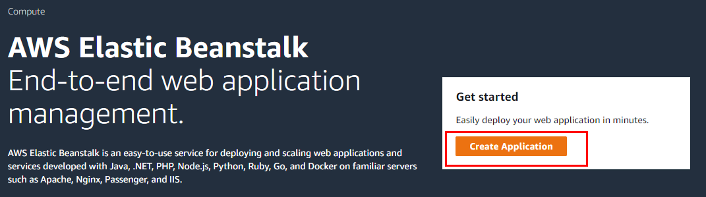

  
  

 

<h3 align="center">AWS Elastic Beanstalk Tutorial</h3>

---

 
      This document is referring to AWS Elastic Beanstalk getting started.

### Tutorial

1. **What is Elastic BeanStalk?**
    - End-to-end web application management.
2. **Click Create Application at [https://console.aws.amazon.com/elasticbeanstalk/home](http://console.aws.amazon.com/elasticbeanstalk/home)**

    

3. **Fill the forms. Select Platform as python and click the `Create Application button`**

    

4. **Wait until completed.**

    

5. **You can change your configuration where `Configuration Page`.**
    - Configuration
        1. Software
        2. Instances
        3. Capacity
        4. Load Balancer
        5. Rolling updates and deploymenets
        6. Security
        7. Monitoring
        8. Managed updates
        9. Notifications
        10. Network
        11. Database
6. **You can see Health on the `Health page`**

    

7. **You can monitor from the `Monitoring Page`**

    

8. **You can see the your web.**

    

    

9. **Upload and Deploy with `YOUR_GIT_DIRECTORY/src/python.zip` file.**

    

    

10. **Check your webpage.**

    

    

11. **Completed!**
